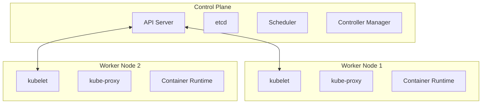
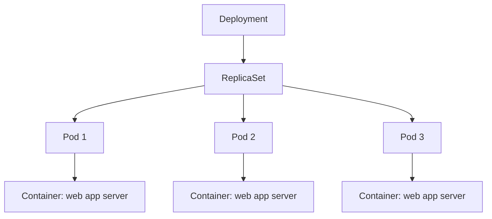
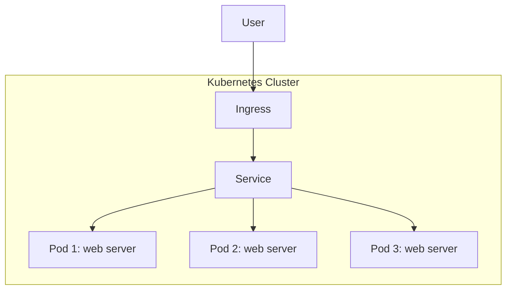
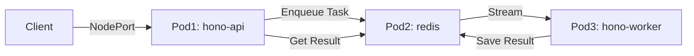

# development-camp-2025-kubenetes

## control plane と worker node

ref: https://kubernetes.io/docs/concepts/overview/components/

今回は minikube を使う

ref: https://minikube.sigs.k8s.io/docs/

## deployment における構成

### ReplicaSet

[Pod を落としても ReplicaSet の値を維持しようとするデモ](./replicaset/README.md)

### (仮)ローリングアップデート

新しいバージョンをリリースしたら、新しい ReplicaSet, Pod がつくられ、古い ReplicaSet が更新される的なデモ

## HPA(Horizontal Pod Autoscaling)

HPA の設定をすれば負荷があがるとうまく対応してくれるよ的なデモ

## プロセス間通信

### 通信制御

#### 一般的な web server として運用するときの図？

[Pod間通信と非同期処理のデモ](./ipc/README.md)

Redis Streamsを使った非同期ワーカーパターン。APIとWorkerを分離し、非同期でタスクを処理する。

