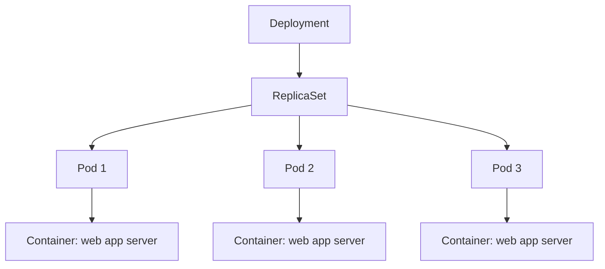
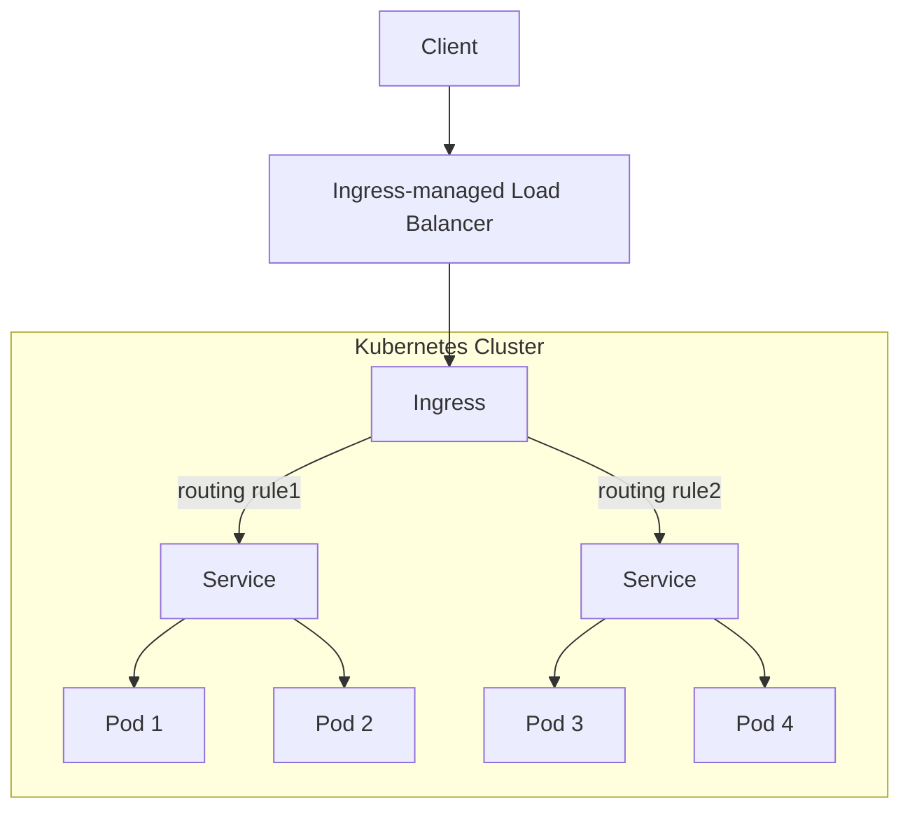
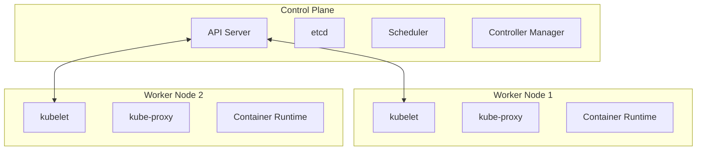

# development-camp-2025-kubenetes

## deployment における構成

### ReplicaSet

[Pod を落としても ReplicaSet の値を維持しようとするデモ](./replicaset/README.md)

## HPA(Horizontal Pod Autoscaling)

[HPA の設定をすれば負荷があがるとうまく対応してくれるよ的なデモ](./hpa/README.md)

## 通信制御

### 一般的な web server

ref: https://kubernetes.io/docs/concepts/services-networking/ingress/#what-is-ingress

Ingress は minikube では arm64 では試せなかったので、設定例だけ載せておく: https://kubernetes.io/docs/concepts/services-networking/ingress/#hostname-wildcards

### Service 間通信

デモする

## 補足: control plane と worker node

ref: https://kubernetes.io/docs/concepts/overview/components/

今回は minikube を使っている

ref: https://minikube.sigs.k8s.io/docs/
