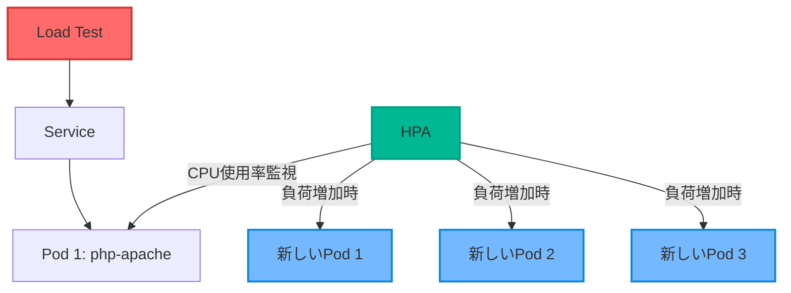

# HPA デモ

負荷が上がると自動的にPod数を増やしてくれるデモ



## デモ手順

### アプリケーションのデプロイ
```bash
kubectl apply -f php-apache.yaml
```

### 確認
```bash
kubectl get deployment php-apache
kubectl get pods -l run=php-apache
kubectl get service php-apache
# サーバが一つしかないため、負荷が来た時に耐えられない・・・
```

### HPAの作成
```bash
kubectl apply -f hpa.yaml
```

### HPAの確認
```bash
kubectl get hpa
kubectl describe hpa php-apache
```

### 負荷テストの実行
```bash
kubectl run -i --tty load-generator --rm --image=busybox --restart=Never -- /bin/sh -c "while true; do wget -q -O- http://php-apache; done"
# 20 秒くらい待つ
```

### スケーリングの確認
```bash
# HPAの状態を監視
kubectl get hpa php-apache --watch

# Pod数の変化を確認
kubectl get pods -l run=php-apache --watch
```

### 負荷テストの停止
```bash
kubectl delete pod load-generator
```

### スケールダウンの確認
```bash
kubectl get hpa php-apache --watch
kubectl get pods -l run=php-apache --watch
```

## クリーンアップ

```bash
kubectl delete hpa php-apache
kubectl delete deployment php-apache
kubectl delete service php-apache
```
