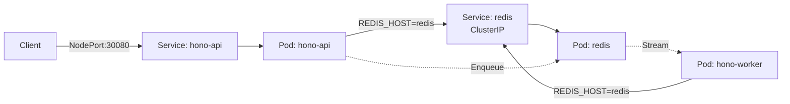

# IPC (Inter-Pod Communication)

Pod間通信と非同期処理のデモ。Redis Streamsを使った非同期ワーカーパターン。

## アーキテクチャ



## セットアップ

```bash
# イメージビルド
docker build -t local/hono-retry-demo:1.0 hono-retry-demo/

# Minikubeにロード
minikube image load local/hono-retry-demo:1.0

# デプロイ
kubectl apply -f k8s/

# 状態確認
kubectl get pods -o wide -l app=hono-api
kubectl get services
```

## 動作確認

### 別ターミナルで監視（推奨）

```bash
# ターミナル1: Pod状態監視
kubectl get pods -o wide -w

# ターミナル2: APIログ
kubectl logs -f deploy/hono-api

# ターミナル3: Workerログ
kubectl logs -f deploy/hono-worker
```


### 非同期計算デモ

Redis Streamsを使った非同期ワーカーパターンの動作確認。

```bash
# 自動デモスクリプト
cd k8s
./demo-resilience.sh
```

<!-- 
## 更新・再デプロイ

```bash
# コード変更後
docker build -t local/hono-retry-demo:1.0 hono-retry-demo/
minikube image load local/hono-retry-demo:1.0

# API Podを再起動
kubectl delete pod -l app=hono-api

# Worker Podを再起動
kubectl delete pod -l app=hono-worker

# Pod状態確認
kubectl get pods -w
```

## クリーンアップ

```bash
kubectl delete -f k8s/
minikube stop
minikube delete
``` -->
