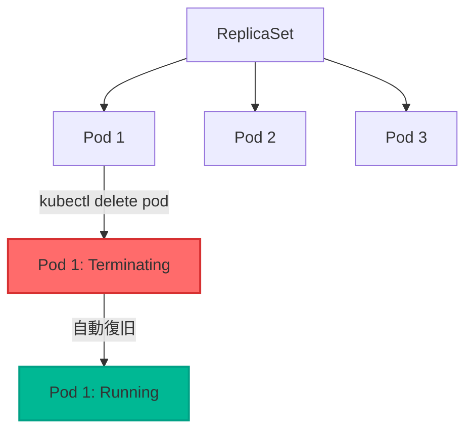

# ReplicaSet デモ

Pod を落としても ReplicaSet の値を維持しようとする的なデモ


## デモ手順

### ReplicaSetのデプロイ
```bash
kubectl apply -f replicaset.yaml
```

### 確認
```bash
kubectl get deployment
kubectl get replicaset
kubectl get pods -l tier=frontend
```

### 復旧監視
```bash
kubectl get pods -l tier=frontend -w
```

### Podの削除
- delete one pod
```bash
kubectl delete pod $(kubectl get pods -l tier=frontend -o jsonpath='{.items[0].metadata.name}')
```

- delete two pods
```bash
kubectl delete pod $(kubectl get pods -l tier=frontend -o jsonpath='{.items[0].metadata.name}') $(kubectl get pods -l tier=frontend -o jsonpath='{.items[1].metadata.name}')
```

### 自動復旧の確認
```bash
kubectl get pods -l tier=frontend
```

## クリーンアップ

```bash
kubectl delete -f replicaset.yaml
kubectl get deployment
kubectl get replicaset
kubectl get pods
```

