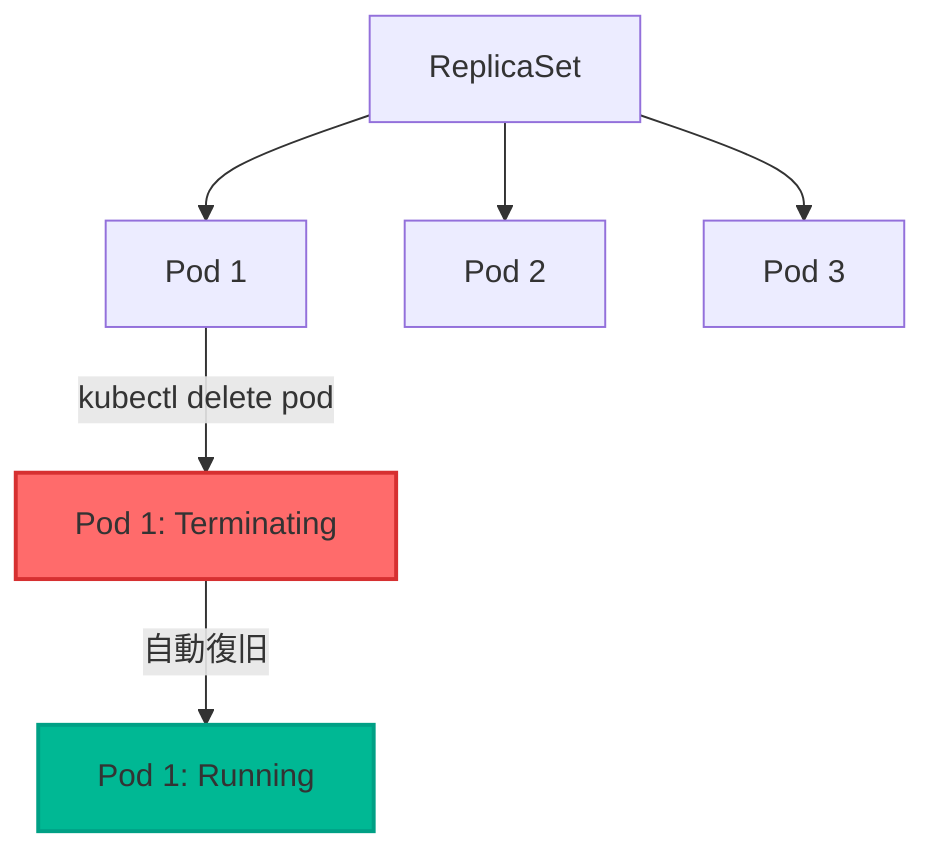

# ReplicaSet デモ

Pod を落としても ReplicaSet の値を維持しようとする的なデモ


## デモ手順

### ReplicaSetのデプロイ
```bash
kubectl apply -f replicaset.yaml
```

### 確認
```bash
kubectl get deployment
kubectl get replicaset
kubectl get pods -l tier=frontend
```

### 復旧監視
```bash
kubectl get pods -l tier=frontend -w
```

### Podの削除
```bash
kubectl delete pod $(kubectl get pods -l tier=frontend -o jsonpath='{.items[0].metadata.name}')
```

### Podを管理外へ変更
```bash
kubectl label pod $(kubectl get pods -l tier=frontend -o jsonpath='{.items[0].metadata.name}') tier=frontend-new --overwrite
```


### 自動復旧の確認
- `tier=frontend`のlebalが3つのpodを維持している
```bash
kubectl get pods -l tier=frontend
```

- タグ書き換えた管理外の`tier=frontend-new`も動いている
```bash
kubectl get pods -l tier=frontend-new
```

## クリーンアップ

```bash
kubectl delete -f replicaset.yaml
kubectl delete pod -l tier=frontend-new # 孤立させたタグpod削除
kubectl get deployment
kubectl get replicaset
kubectl get pods
```

